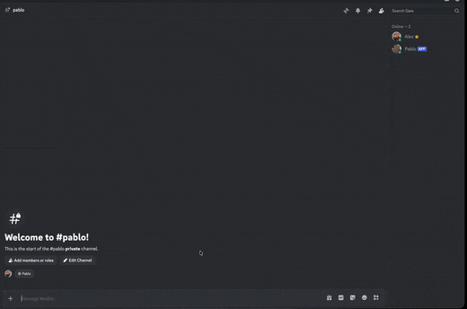

# arr-mcp-server

> Control your self-hosted media stack (Radarr, Sonarr, qBittorrent, Plex) from any MCP-compatible AI client — in plain English.

[](https://www.npmjs.com/package/arr-mcp-server)
[](LICENSE)
[](https://nodejs.org)

## Demo



*Pablo (a Discord bot running Hermes Agent) responds to a natural-language query about active downloads. Behind the scenes, Hermes calls the `list_downloads` tool exposed by `arr-mcp-server`, which aggregates state from qBittorrent, Radarr, and Sonarr into a single readable response.*

`arr-mcp-server` is a [Model Context Protocol](https://modelcontextprotocol.io) server that exposes your homelab media stack as a set of tools any MCP client can call. Connect it to Claude Desktop, Hermes Agent, Cursor, or any other MCP-compatible client, and manage your library conversationally: *"add the latest Denis Villeneuve movie in 4K"*, *"what's downloading right now?"*, *"is Severance already on my Plex?"*.

**Why this exists:** running a \*arr stack means juggling four or five web UIs to do one simple thing — find a title, check quality profiles, add it, watch the download queue, verify it landed in Plex. This server collapses that whole workflow into a conversation: instead of clicking through Radarr, Sonarr and Overseerr, you tell your assistant *"Pablo, add Anora to my library"* or *"what's downloading?"* — from Discord, Claude Desktop, or wherever your assistant lives. The AI client handles the orchestration (search → pick the right match → add → monitor); you just say what you want.

## ✨ Features

Seven MCP tools, all validated with Zod:

- **`search_movie`** — search a movie by title via Radarr (TMDB metadata, ratings, overview)
- **`add_movie`** — add a movie to Radarr and trigger a release search, with quality profile selection
- **`search_series`** — search a TV series by title via Sonarr (TVDB metadata, network, status)
- **`add_series`** — add a series to Sonarr with monitoring options (all seasons, future only, latest season, …)
- **`list_downloads`** — consolidated view of active downloads across qBittorrent, Radarr and Sonarr queues (progress, speed, ETA, import status, errors)
- **`get_library`** — browse the Plex library: overview with item counts, recently added, or title search
- **`ping`** — verify the server is responding

## Supported services

- [Radarr](https://radarr.video/) — movie collection manager
- [Sonarr](https://sonarr.tv/) — TV series collection manager
- [qBittorrent](https://www.qbittorrent.org/) — download client (Web UI)
- [Plex Media Server](https://www.plex.tv/) — media library
- [Overseerr](https://overseerr.dev/) — request management (config required; tools coming — see note in [Configuration](#%EF%B8%8F-configuration))

## Requirements

- **Node.js >= 20**
- Running instances of the supported services above, network-reachable from the machine running the MCP server
- API keys / credentials for each service

## 📦 Installation

### Global npm install

```bash
npm install -g arr-mcp-server
```

This provides the `arr-mcp-server` binary that MCP clients can spawn directly.

### Docker

```bash
git clone https://github.com/alexscdt/arr-mcp-server.git
cd arr-mcp-server
docker build -t arr-mcp-server .
docker run -i --rm --env-file .env arr-mcp-server
```

The container speaks MCP over stdio, so keep `-i` (interactive) when a client spawns it.

### From source

```bash
git clone https://github.com/alexscdt/arr-mcp-server.git
cd arr-mcp-server
npm install
npm run build
npm start
```

## ⚙️ Configuration

All configuration is done through environment variables (a `.env` file in the working directory is also loaded via dotenv). Copy `.env.example` to get started. The server validates everything at startup and exits with a detailed error if anything is missing or malformed.

| Variable | Required | Description | Example |
| --- | --- | --- | --- |
| `RADARR_URL` | Yes | Base URL of your Radarr instance | `http://127.0.0.1:7878` |
| `RADARR_API_KEY` | Yes | Radarr API key (Settings → General → Security) | `a1b2c3d4…` |
| `SONARR_URL` | Yes | Base URL of your Sonarr instance | `http://127.0.0.1:8989` |
| `SONARR_API_KEY` | Yes | Sonarr API key (Settings → General → Security) | `a1b2c3d4…` |
| `QBITTORRENT_URL` | Yes | Base URL of the qBittorrent Web UI | `http://127.0.0.1:8080` |
| `QBITTORRENT_USERNAME` | Yes | qBittorrent Web UI username | `admin` |
| `QBITTORRENT_PASSWORD` | Yes | qBittorrent Web UI password | `adminadmin` |
| `PLEX_URL` | Yes | Base URL of your Plex Media Server | `http://127.0.0.1:32400` |
| `PLEX_TOKEN` | Yes | Plex authentication token ([how to find it](https://support.plex.tv/articles/204059436-finding-an-authentication-token-x-plex-token/)) | `xxxxxxxxxxxx` |
| `OVERSEERR_URL` | Yes | Base URL of your Overseerr instance | `http://127.0.0.1:5055` |
| `OVERSEERR_API_KEY` | Yes | Overseerr API key (Settings → General) | `MTxxxxxxxxxx…` |
| `LOG_LEVEL` | No | Log level: `debug`, `info`, `warn`, `error` (default: `info`) | `info` |

> **Note on Overseerr:** the Overseerr variables are currently required by config validation, but no tool uses Overseerr yet — it is reserved for upcoming request/discovery features. Point them at your instance (or any valid URL + non-empty key) for now.

### Getting a Plex token

Three common ways to find your `PLEX_TOKEN`:

1. **Browser DevTools** — log in to [app.plex.tv](https://app.plex.tv), open DevTools → Network tab, and look for the `X-Plex-Token` query parameter on any request (or inspect the XML of a media item via "Get Info" → "View XML" — the token is in the URL). Full walkthrough in the [official Plex support article](https://support.plex.tv/articles/204059436-finding-an-authentication-token-x-plex-token/).
2. **Via Overseerr** — if you already run Overseerr, it stores the Plex token it uses under Settings → Plex.
3. **Via the Plex API** — request a PIN with your credentials against `https://plex.tv/pins.xml` and exchange it for a token (useful for scripted setups).

## 🚀 Usage

### Claude Desktop

Add this to your `claude_desktop_config.json` (Settings → Developer → Edit Config):

```json
{
  "mcpServers": {
    "arr-media-stack": {
      "command": "arr-mcp-server",
      "env": {
        "RADARR_URL": "http://127.0.0.1:7878",
        "RADARR_API_KEY": "your_radarr_api_key",
        "SONARR_URL": "http://127.0.0.1:8989",
        "SONARR_API_KEY": "your_sonarr_api_key",
        "QBITTORRENT_URL": "http://127.0.0.1:8080",
        "QBITTORRENT_USERNAME": "admin",
        "QBITTORRENT_PASSWORD": "your_qbittorrent_password",
        "PLEX_URL": "http://127.0.0.1:32400",
        "PLEX_TOKEN": "your_plex_token",
        "OVERSEERR_URL": "http://127.0.0.1:5055",
        "OVERSEERR_API_KEY": "your_overseerr_api_key"
      }
    }
  }
}
```

Restart Claude Desktop; the tools appear under the 🔌 icon.

### Hermes Agent

The repo ships a [`hermes-manifest.yaml`](hermes-manifest.yaml) as the canonical reference for configuring this server with Hermes — it documents the transport, every environment variable with its prompt and default, and setup notes. (The official Hermes MCP catalog is curated, so this file lives here as reference documentation for manual configuration.)

Add this under `mcp_servers` in `~/.hermes/config.yaml` (credentials go in `~/.hermes/.env` or your environment):

```yaml
mcp_servers:
  arr-media-stack:
    transport: stdio
    command: arr-mcp-server
    env:
      RADARR_URL: "http://127.0.0.1:7878"
      RADARR_API_KEY: "your_radarr_api_key"
      SONARR_URL: "http://127.0.0.1:8989"
      SONARR_API_KEY: "your_sonarr_api_key"
      QBITTORRENT_URL: "http://127.0.0.1:8080"
      QBITTORRENT_USERNAME: "admin"
      QBITTORRENT_PASSWORD: "your_qbittorrent_password"
      PLEX_URL: "http://127.0.0.1:32400"
      PLEX_TOKEN: "your_plex_token"
      OVERSEERR_URL: "http://127.0.0.1:5055"
      OVERSEERR_API_KEY: "your_overseerr_api_key"
```

### Cursor and other MCP clients

Any client that supports stdio MCP servers works the same way: configure it to spawn the `arr-mcp-server` command with the environment variables above. In Cursor, add the equivalent entry in `.cursor/mcp.json` (`"command": "arr-mcp-server"` plus the `env` block).

## 🧰 Available tools

### `ping`

Verify the MCP server is responding.

| Param | Type | Required | Description |
| --- | --- | --- | --- |
| `message` | string | No | Optional message to echo back |

> *"Ping the media server to check it's alive."*

### `search_movie`

Search for a movie by title. Returns matching movies with metadata (title, year, TMDB id, overview, ratings). Use it before `add_movie` to find the exact `tmdbId`.

| Param | Type | Required | Description |
| --- | --- | --- | --- |
| `query` | string | Yes | Movie title to search for (e.g. `"Anora"`, `"Inception"`) |
| `limit` | number | No | Max results to return (1–20, default: 5) |

> *"Find the movie Dune Part Two."*

### `add_movie`

Add a movie to Radarr and trigger a release search. Requires a `tmdbId` (from `search_movie`). Uses the first available quality profile and root folder by default.

| Param | Type | Required | Description |
| --- | --- | --- | --- |
| `tmdbId` | number | Yes | TMDB id of the movie (obtained from `search_movie`) |
| `qualityProfileName` | string | No | Quality profile name (e.g. `"HD-1080p"`, `"Ultra-HD"`). Falls back to the first profile |
| `searchNow` | boolean | No | Trigger a search immediately after adding (default: `true`) |

> *"Add Dune Part Two to Radarr in Ultra-HD."*

### `search_series`

Search for a TV series by title. Returns matching series with metadata (title, year, TVDB id, overview, network, status). Use it before `add_series` to find the exact `tvdbId`.

| Param | Type | Required | Description |
| --- | --- | --- | --- |
| `query` | string | Yes | Series title to search for (e.g. `"Severance"`, `"Breaking Bad"`) |
| `limit` | number | No | Max results to return (1–20, default: 5) |

> *"Search for the show Severance."*

### `add_series`

Add a TV series to Sonarr and trigger a search for missing episodes. Requires a `tvdbId` (from `search_series`). Monitors all seasons by default.

| Param | Type | Required | Description |
| --- | --- | --- | --- |
| `tvdbId` | number | Yes | TVDB id of the series (obtained from `search_series`) |
| `qualityProfileName` | string | No | Quality profile name (e.g. `"HD-1080p"`). Falls back to the first profile |
| `monitor` | string | No | What to monitor: `all` (default), `future`, `missing`, `existing`, `firstSeason`, `latestSeason`, `none` |
| `searchNow` | boolean | No | Trigger a search for missing episodes immediately (default: `true`) |

> *"Add Severance to Sonarr but only monitor the latest season."*

### `list_downloads`

List all active and pending downloads across qBittorrent, Radarr and Sonarr — a consolidated view of what is downloading, awaiting import, or stuck in error.

| Param | Type | Required | Description |
| --- | --- | --- | --- |
| `includeCompleted` | boolean | No | Include recently completed / seeding downloads (default: `false`) |

> *"What's downloading right now?"*

### `get_library`

Get an overview of the Plex library: list all libraries with item counts, show recently added items, or search for a title within Plex.

| Param | Type | Required | Description |
| --- | --- | --- | --- |
| `mode` | string | No | `overview` (default), `recent`, or `search` |
| `query` | string | If `mode` is `search` | Search query |
| `limit` | number | No | Max items to return (1–50, default: 10) |

> *"Is Interstellar already on my Plex?"*

## 🛠️ Development

```bash
npm install          # install dependencies
cp .env.example .env # then fill in your credentials
npm run dev          # run with hot reload (tsx watch)
npm run typecheck    # TypeScript type checking (strict mode)
npm test             # run the Vitest suite
npm run build        # compile to dist/
```

## Contributing

Contributions are welcome! Please read [CONTRIBUTING.md](CONTRIBUTING.md) for the development setup, code conventions, and the step-by-step guide to adding a new tool.

## License

[MIT](LICENSE)

## Acknowledgments

- [Model Context Protocol](https://modelcontextprotocol.io) by Anthropic — the spec and TypeScript SDK this server is built on
- [LinuxServer.io](https://www.linuxserver.io/) — the container images most of us run our media stacks on
- The [Radarr](https://radarr.video/), [Sonarr](https://sonarr.tv/) and wider \*arr community for the excellent APIs and documentation

## Where to find this MCP

- **npm** — https://www.npmjs.com/package/arr-mcp-server
